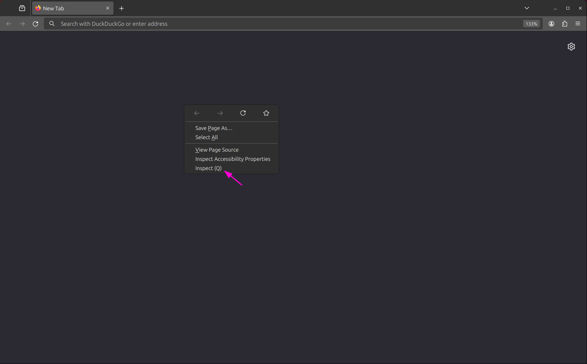
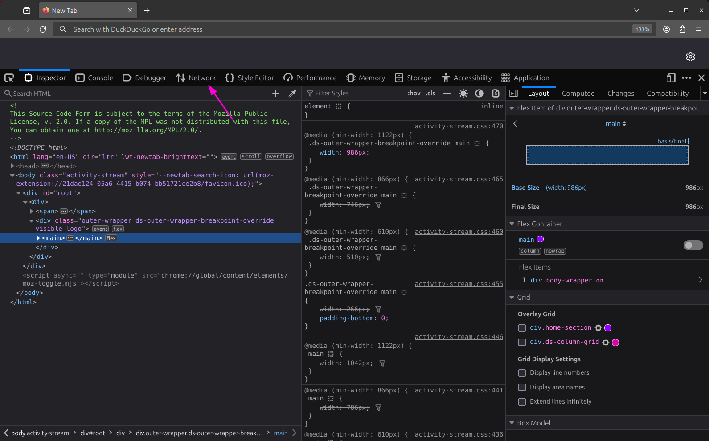
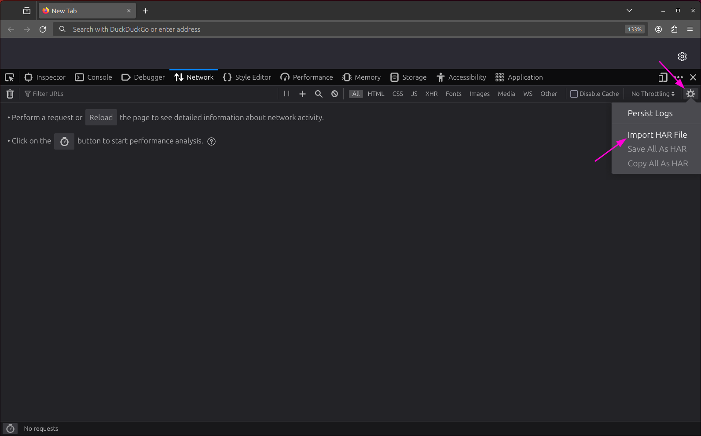
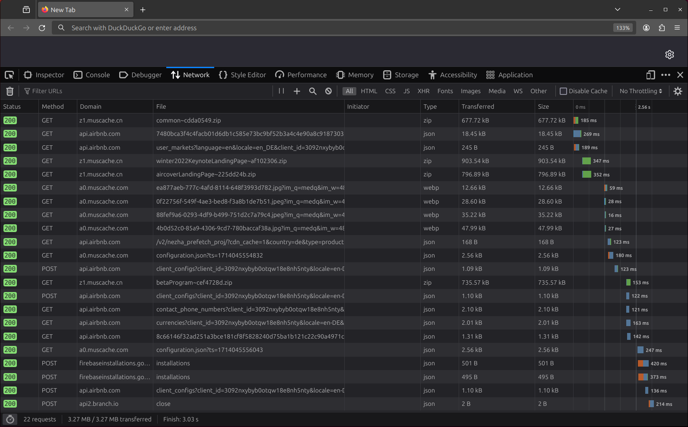
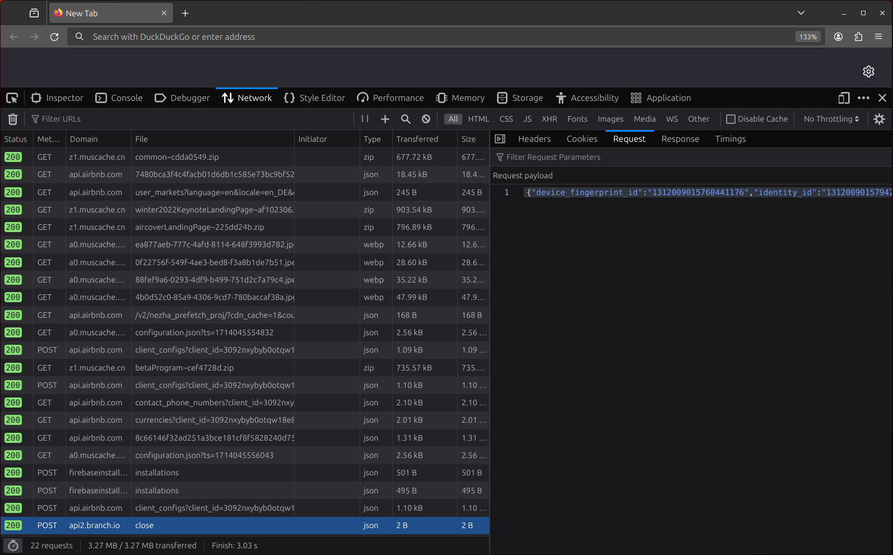

{
    "title": "Viewing HAR files",
    "weight": 30,
    "description": "The tweasel tools and libraries make heavy use of HAR files, a standard format for HTTP(S) traffic recordings. Learn how to view the contents of a HAR file in Firefox and Google Chrome."
}

[HAR](http://www.softwareishard.com/blog/har-12-spec/) (HTTP Archive) is a standard file format for HTTP(S) traffic recordings. It is used by web browsers and HTTP(S) monitoring tools to export collected requests and responses. The tweasel tools and libraries use HAR files to allow for interoperability with other tools: You can analyze HAR files created with third-party tools using TrackHAR. Conversely, you can also view HAR files created by cyanoacrylate or tweasel CLI using your web browser, which is what this tutorial will focus on.

## Viewing HAR files in Firefox

In Firefox, you can view HAR files using the Developer Tools. Open a new tab and right-click on the page and select *Inspect* (or press <kbd>Ctrl</kbd> + <kbd>Shift</kbd> + <kbd>I</kbd>).

In the Developer Tools section that opens, click on the *Network* tab.

Click on the cog icon in the top right corner of the tab. Then, click *Import HAR file*.

After you have selected your HAR file in the file picker, you will see a list of the requests recorded therein.

If you click on an entry in the table, you will see a detailed view of the request. Using the tab bar at the top, you can switch between seeing the headers and cookies as well as the request and response payloads.

